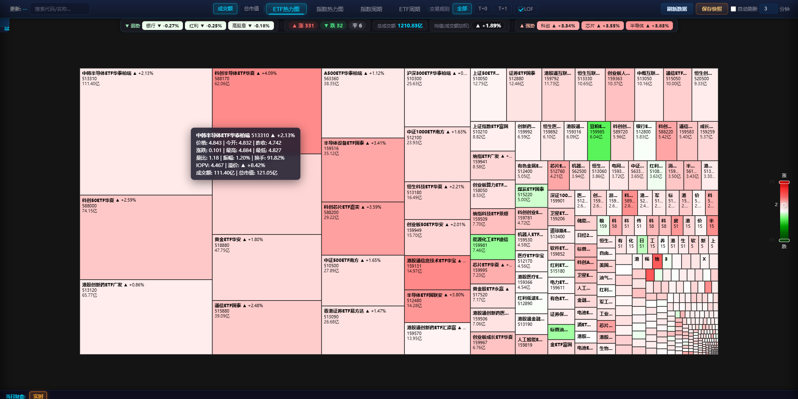
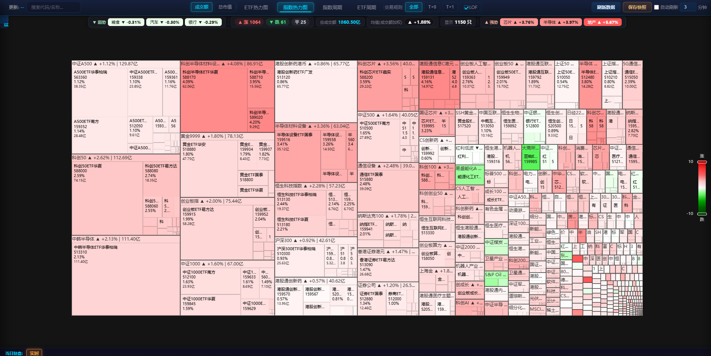
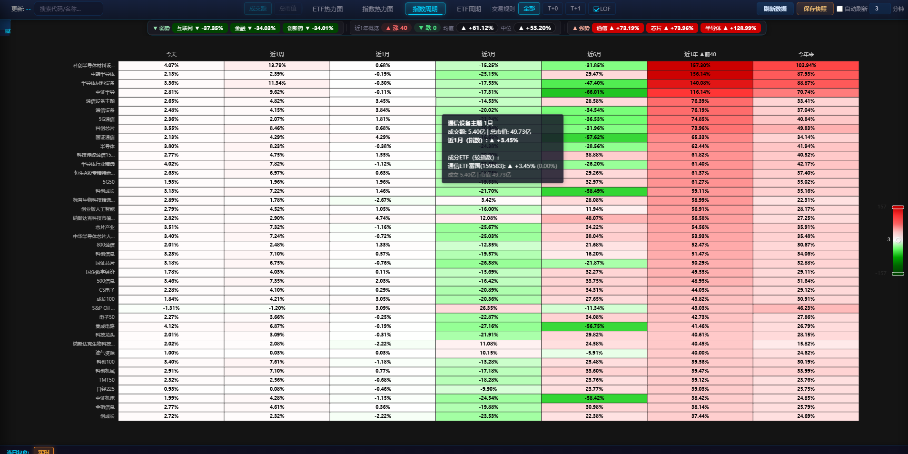
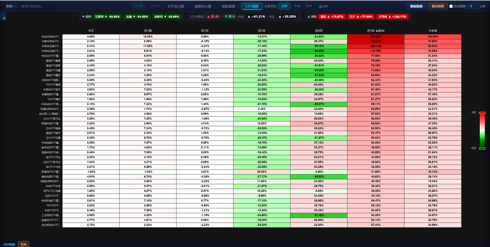
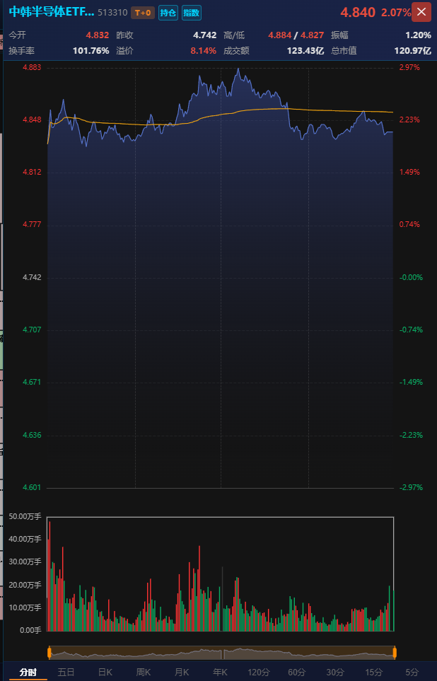
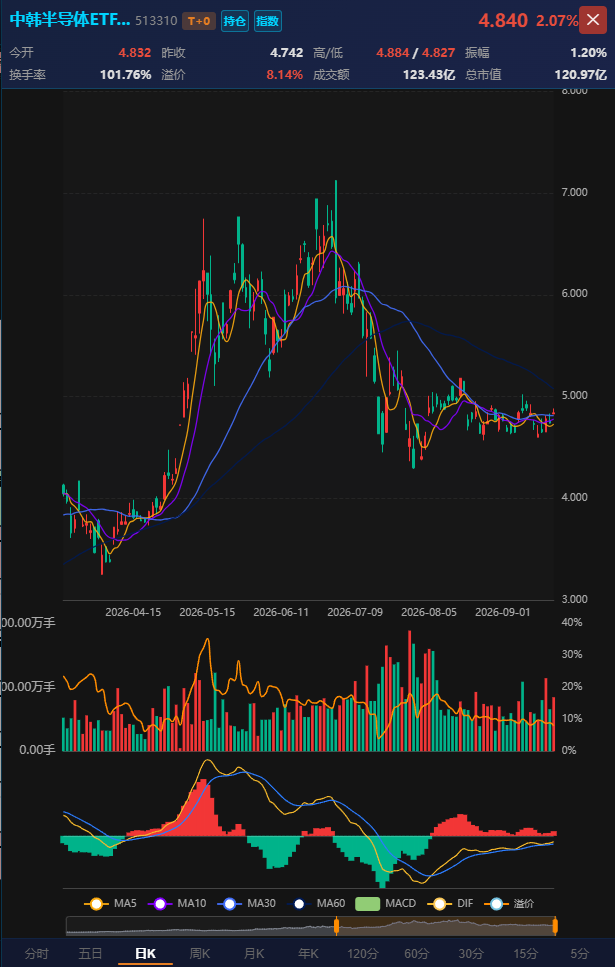
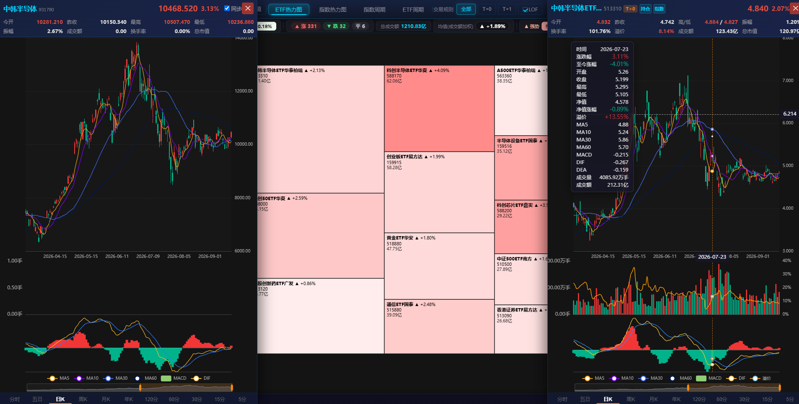

# ETF 热力图

一个基于 ECharts 的 A 股 ETF 实时行情热力图页面。深色主题，全浏览器运行，无需安装任何依赖，打开即可查看全市场 ETF 的涨跌分布。

## 功能特性

- **四大视图一键切换**：
  - **ETF 热力图**：全市场 ETF 按跟踪指数去重（同一指数保留规模最大的一只），矩形面积映射成交额或总市值，颜色按当日涨跌幅着色（红涨绿跌）
  - **指数热力图**：以「指数 → 成分 ETF」两级层级树展示，外层看指数强弱，下钻看对应 ETF 分布
  - **指数周期**：按指数分组（成交额加权平均），Top 40 指数 × 7 个周期的涨跌幅矩阵，每列独立归一化着色
  - **ETF 周期**：每行一只 ETF，Top 40 × 7 个周期的涨跌幅矩阵，横向对比短中长期表现
- **多周期矩阵**：今天 / 近1周 / 近1月 / 近3月 / 近6月 / 近1年 / 今年来，共 7 个周期
- **面积口径切换**：热力图支持按「成交额」或「总市值」决定矩形面积
- **T+0 / T+1 板块**：按交易制度分类展示（自动排除货币 ETF、债券类 LOF），并可勾选包含 LOF 基金
- **ETF 搜索**：顶部搜索框按名称 / 代码 / 关键词实时检索，支持键盘 Esc 清除
- **详情面板**（点击任意矩形打开）：
  - 走势图表：分时 / 五日 / 日K / 周K / 月K / 年K，以及 120分 / 60分 / 30分 / 15分 / 5分 等分钟级 K 线
  - IOPV 参考净值（实时估值）曲线与折溢价率
  - 今开 / 昨收 / 最高最低 / 振幅 / 换手率 / 成交额 / 总市值等关键指标
  - 基金前十大持仓，持仓个股支持直接查看行情与 K 线
  - 跟踪指数行情、走势及指数成分股列表，支持与 ETF 同屏联动
- **历史复盘**：交易时间内自动保存行情快照（也可手动保存），底部时间轴可在实时与 09:30–15:00 各时间点之间切换，回看历史盘面
- **自动刷新**：可配置自动刷新间隔（1–30 分钟，默认 3 分钟），盘中数据持续更新

## 功能截图

### ETF 热力图

全市场 ETF 实时行情一览，红涨绿跌，矩形面积映射成交额/总市值，悬浮可查看价格、IOPV、折溢价等明细。



### 指数热力图

以跟踪指数为外层分组、成分 ETF 为子块的层级热力图，先看指数强弱、再看个基分布。



### 指数周期

Top 40 指数在 7 个周期上的涨跌幅矩阵，按列独立归一化着色，强弱与轮动一目了然。



### ETF 周期

Top 40 ETF 的多周期涨跌幅矩阵，逐只基金对比短、中、长期表现。



### 分时走势

点击任意矩形打开详情面板，分时图叠加价格线与均价线，下方为分时成交量（红涨绿跌），顶部展示今开、昨收、高低、振幅、换手率、溢价、成交额与总市值。



### 日 K 线

日 K 线主图叠加 MA5 / MA10 / MA30 / MA60 均线，副图依次为成交量（叠加换手率曲线）与 MACD（DIF / DEA），并可叠加溢价率曲线，辅助判断趋势与折溢价时机。



### 指数与 ETF 同屏联动

开启「同步」后，跟踪指数（左）与 ETF（右）可同屏对照，十字光标联动定位，悬浮提示展示当日开高低收、成交量、净值及涨跌幅、溢价、各周期均线与 MACD 等完整指标。



## 快速开始

### 方式一：直接打开（推荐）

直接用浏览器打开 `etf_heatmap.html` 即可使用，无需安装任何依赖。ECharts 通过 CDN 引入，首次打开需保持网络连接。

### 方式二：本地静态服务器

若部分数据加载不出来，可通过本地静态服务器访问：

```bash
# Python 3
python -m http.server 8080
```

然后浏览器打开 `http://localhost:8080/etf_heatmap.html`。

## 项目结构

```
heatmap/
├── etf_heatmap.html   # 主页面（HTML + CSS + JS 单文件，内含全部业务逻辑）
├── proxy-server.js    # 可选的本地数据代理（Node.js，基于 Playwright）
├── package.json       # 代理的依赖声明（仅使用代理时需要）
├── img/               # 文档截图与打赏二维码
├── .gitignore
├── LICENSE
└── README.md
```

## 数据源说明

页面展示的全部行情、规模、持仓等数据，均来自以下公开数据提供方，本项目不生产、不存储任何行情数据：

- **东方财富**：ETF/指数实时行情（延时行情，可能存在约 15 分钟延时）、成交额与总市值、多周期涨跌幅、基金规模与折溢价、历史 K 线、基金持仓、指数成分股及关键词检索
- **天天基金**：IOPV 参考净值（实时估值）曲线
- **第三方公开节假日服务**：用于辅助判断是否交易日（获取失败时仅按周末判断）

其中行情、数据中心等服务支持浏览器直接访问，因此**仅上传 `etf_heatmap.html` 一个文件即可正常使用大部分功能**。数据版权归相应提供方所有，如数据方认为不妥，可联系作者移除。

## 本地数据代理（可选）

部分接口（如历史 K 线、基金持仓）在浏览器直连失败时，会自动降级到本地代理服务 `http://localhost:5000/proxy`；页面内置失败探测与冷却机制，无需手动切换。

本仓库附带的 [proxy-server.js](proxy-server.js) 是一个 Node.js 代理，提供两种转发通道：

- `/proxy/<目标地址>`：普通 HTTP 转发（轻量请求）
- `/proxy/playwright/<目标地址>`：基于 Playwright 的无头浏览器请求（携带真实浏览器环境，用于获取直连失败的接口数据），内置 2 页并发页池

如需启用：

```bash
# 安装依赖（Playwright，首次使用需准备浏览器内核）
npm install
npx playwright install chrome

# 启动代理（或 npm start）
node proxy-server.js
```

启动后页面将自动把失败的请求降级到该代理；不启动也不影响基本使用。

> 注意：代理仅供个人学习时低频使用，请勿高频或大规模请求数据接口，以免给数据提供方造成不必要的压力。

## 免责声明

1. 本项目为**个人学习、研究用途**的开源项目，数据来源于公开网络接口，仅作技术展示与交流，**不构成任何投资建议或投资推荐**。
2. 数据可能存在延迟、中断或错误，本项目**不对数据的准确性、完整性、实时性作任何保证**。
3. 任何依据本页面数据作出的投资决策，**风险自负**；作者不对因使用本项目产生的任何直接或间接损失承担责任。
4. 请遵守相关法律法规及数据提供方的服务条款，**合法合规、克制**地使用本项目；MIT 协议仅授权本项目代码本身，通过公开接口获取的数据须以数据提供方规则为准。
5. 打赏为**自愿的无偿赠与**，不构成任何形式的交易、付费服务或合同关系，打赏后不提供任何附加权益、承诺或售后服务。

## 打赏支持

如果本项目对你有帮助，欢迎扫描下方二维码打赏，感谢你的支持！


> 打赏纯属自愿，是对开源作者的无偿支持，请理性打赏。

## License

本项目代码以 [MIT License](LICENSE) 开源。

> 该协议仅覆盖本项目代码本身，不涵盖通过公开接口获取的数据（数据版权归相应数据提供方所有）。文中出现的东方财富、天天基金等名称及商标，均归其各自所有者所有。
